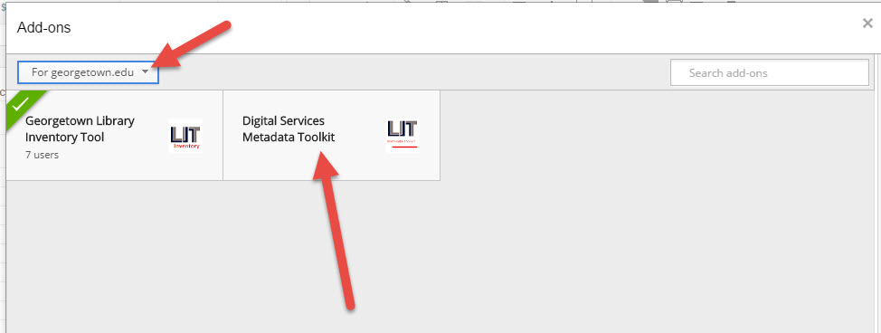
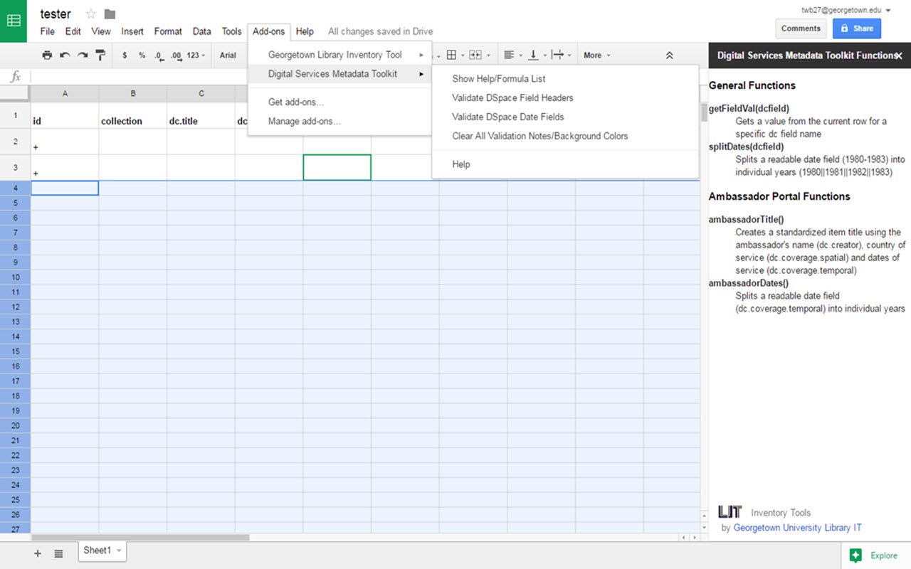

# DigitalServicesMetadataToolkit
Custom Google Sheets Formulas and Add-On Functions to Support Metadata Management for Digital Collections

## Installation

## Using the Tool

### DSpace Metadata Validation Menu Items

Menu items are available to verify Bulk Metadata Editing files.

Custom formulas are also available to support common data consistency initiatives.